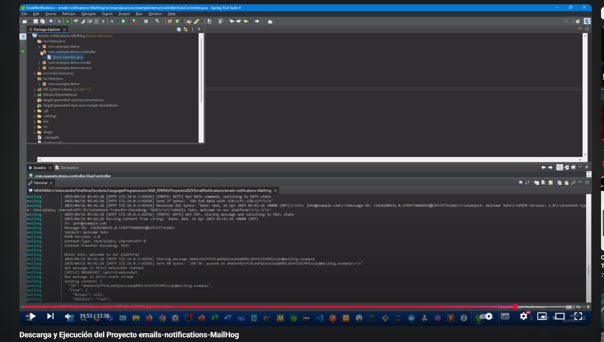

<div align = "center">
  
</div>


  <div align="right">
    
    
    
    
    
     
     
        
  </div>


<br>

<br>

<div align="right">
     <a href="./src/main/resources/static/translation/README.es.md" target="_blank">
       
   </a>
    <a href="https://github.com/andresWeitzel/emails-notifications-MailHog" target="_blank">
       
   </a>
</div>

<br>

<div align="center">  

# Email Notifications MailHog 


</div>

This is a Spring Boot-based demo project for sending emails. It uses MailHog as an SMTP server for local testing and is fully Dockerized for easy execution.

* [Functional tests video](https://www.youtube.com/watch?v=QMlpFdOQHfI) <a href="https://www.youtube.com/watch?v=QMlpFdOQHfI" target="_blank"> </a>


## Sections

<details>
<summary>1. Features</summary>

<br>

* User Registration: Through a REST controller, users can register and receive a welcome email.

* Sending Emails: Using JavaMailSender to send emails through MailHog in the development environment.

</details>


<details>
<summary>2. Requirements</summary>

<br>

* Java 17 or higher.

* Docker to run MailHog and the containerized application.

</details>

<details>
<summary>3. Technologies and Dependencies</summary>

<br>

* Spring Boot: Core framework for building Java applications.

* Spring Boot Starter Web: For creating RESTful web applications.

* Spring Boot Starter Mail: For handling emails.

* Lombok: A library to reduce boilerplate in code.

* MailHog: SMTP server for local email testing.

* Docker: For creating and managing application containers.

</details>

<details>
<summary>4. Configuration and Execution</summary>

<br>

* If any of the following steps don't work, watch this [video](https://www.youtube.com/watch?v=QMlpFdOQHfI)

* Repository Clone
```git
# Clone the repository
git clone https://github.com/youruser/email-notifications.git
cd email-notifications
```

* Before building the Docker image, you need to generate the JAR file of the project. Run the following command from the root directory of the project:
```git
./mvnw clean package
# or
mvn clean package # (If you have Maven installed globally)
```

* This will create a .jar file inside the target/ directory, with a name similar to:
```git
target/email-notifications-0.0.1-SNAPSHOT.jar
```

* This file will be used by Docker to build the application image.

* Before building and running the containers, make sure you have Docker running (for Windows, use [Docker Desktop](https://www.docker.com/products/docker-desktop))

* Once installed, make sure Docker is running
```git
docker --version
```

* Once Docker is running, you can build and deploy the containers
```git
docker-compose up --build
```

* If there is any problem building our service environment with Docker and if any image is in use and you cannot remove it directly, you can force the removal with the following command:
```git
docker rmi -f $(docker images -q)
```

* Then, to do a general cleanup of everything unused (stopped containers, untagged images, unused networks, etc.), you can use the following command:
```git
docker system prune -a --volumes
```

* We rebuild our containers
```git
docker-compose up --build
```

</details>

<details>
<summary>5. Project Structure</summary>

<br>

```
emails-notifications-MailHog/
├── src/
│   ├── main/
│   │   ├── java/com/example/demo/
│   │   │   ├── controller/UserController.java
│   │   │   ├── model/User.java
│   │   │   └── service/EmailService.java
│   │   └── resources/
│   │       ├── application.properties
│   │       └── static/img/
│   │           ├── arg-flag.jpg
│   │           ├── eeuu-flag.jpg
│   │           └── mailhog.jpeg
│   │       └── static/translation/README.es.md
│   └── test/java/com/example/demo/EmailNotificationsApplicationTests.java
├── docker-compose.yml
├── Dockerfile
├── pom.xml
└── README.md
```

</details>

<details>
<summary>6. Processing Flow</summary>

<br>

1. **User Registration**: Receives a POST request with user data (name, email).

2. **Email Sending**: Sends a welcome email to the registered user using MailHog as SMTP.

3. **Email Verification**: The email can be viewed in the MailHog web interface.

</details>

<details>
<summary>7. Testing</summary>

<br>

#### [Watch video](https://www.youtube.com/watch?v=QMlpFdOQHfI)

  <a href="https://www.youtube.com/watch?v=QMlpFdOQHfI">
    
  </a> 

<br>

### 1. Verify that the application is running

* **Verify Docker containers:**
```bash
docker ps
```

You should see two containers running:
- `springboot-app` on port 8080
- `mailhog` on port 8025

* **Verify application logs:**
```bash
docker logs springboot-app
```

### 2. Access MailHog

* The MailHog web interface will be available at `http://localhost:8025`

* Here you can see all emails sent by the application

* The interface shows: sender, recipient, subject and email content

### 3. API test cases

#### Case 1: Successful user registration

**Endpoint:** `POST http://localhost:8080/api/users`

**Headers:** `Content-Type: application/json`

**Body:**
```json
{
    "name": "John Doe",
    "email": "john.doe@example.com"
}
```

**Expected response:**
```json
{
    "status": 200,
    "message": "User registered and email sent."
}
```

#### Case 2: Registration with minimal data

**Body:**
```json
{
    "name": "Jane",
    "email": "jane@test.com"
}
```

#### Case 3: Registration with special characters

**Body:**
```json
{
    "name": "María José",
    "email": "maria.jose@company.com"
}
```

### 4. Email verification in MailHog

After each successful registration, verify at `http://localhost:8025`:

* **Sender:** `spring-boot@localhost`

* **Recipient:** The email provided in the request

* **Subject:** `Welcome [name]`

* **Content:** `Hello [name], welcome to our platform!`

### 5. Test cases with tools

#### Using cURL

```bash
# Basic registration
curl -X POST http://localhost:8080/api/users \
  -H "Content-Type: application/json" \
  -d '{"name": "Carlos López", "email": "carlos@example.com"}'
```

#### Using Postman

1. Create new collection "Email Notifications"

2. Create POST request to `http://localhost:8080/api/users`

3. Add in Headers: `Content-Type: application/json`

4. Add in Body (raw JSON):
```json
{
    "name": "Test User",
    "email": "test@example.com"
}
```

### 6. Cleanup and restart

#### Clear emails in MailHog

* Access `http://localhost:8025`

* Click "Delete All" to clear all emails

#### Restart services

```bash
# Stop services
docker-compose down

# Restart services
docker-compose up --build

# Restart only the application
docker-compose restart app
```

### 7. Troubleshooting

#### Problem: No emails received

* Verify that MailHog is running: `docker ps`

* Verify MailHog logs: `docker logs mailhog`

* Verify SMTP configuration in `application.properties`

#### Problem: API connection error

* Verify that the application is running: `docker ps`

* Verify application logs: `docker logs springboot-app`

* Verify that port 8080 is available

#### Problem: Docker error

```bash
# Clean Docker completely
docker system prune -a --volumes
docker-compose up --build
```

* `Important` : Now the application is Dockerized. We can stop or run the app directly with Docker.

</details>

<details>
<summary>8. Implemented Validations</summary>

<br>

* Email must be present and valid format (handled by JavaMailSender, but you can extend validation in the User model or controller).

* Name must be present.

</details>

<details>
<summary>9. Reports</summary>

<br>

* **MailHog Web Interface:** All sent emails can be viewed at [http://localhost:8025](http://localhost:8025)

* **Application Logs:**
  * View logs with `docker logs springboot-app`
  * View MailHog logs with `docker logs mailhog`

* **Troubleshooting:** See the Troubleshooting section in Testing.

</details>

<details>
<summary>10. Contributing</summary>

<br>

1. Fork the project

2. Create your feature branch (`git checkout -b feature/AmazingFeature`)

3. Commit your changes (`git commit -m 'Add some AmazingFeature'`)

4. Push to the branch (`git push origin feature/AmazingFeature`)

5. Open a Pull Request

</details>

<details>
<summary>11. License</summary>

<br>

This project is under the MIT License - see the LICENSE file for details.

</details>

<details>
<summary>12. About</summary>

<br>

This project implements a simple email notification system using Spring Boot and MailHog for local SMTP testing. It is fully Dockerized for easy local development and testing.

</details>
