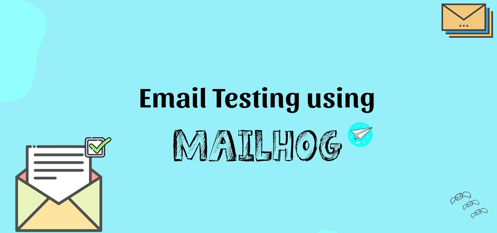

<div align = "center">
  
</div>

<br>

<div align="right">
     <a href="./README.es.md" target="_blank">
       
   </a>
    <a href="https://github.com/andresWeitzel/emails-notifications-MailHog" target="_blank">
       
   </a>
</div>

<div align="center">

## Notificaciones por correo electrónico MailHog

</div>

<br>

Este es un proyecto de demostración basado en Spring Boot para el envío de correos electrónicos. Utiliza MailHog como servidor SMTP para pruebas locales y está completamente Dockerizado para una fácil ejecución.
[Demo](https://www.youtube.com/watch?v=QMlpFdOQHfI)

### Tecnologías y dependencias
* Spring Boot: Framework principal para la creación de aplicaciones Java.
* Spring Boot Starter Web: Para crear aplicaciones web RESTful.
* Spring Boot Starter Mail: Para gestionar correos electrónicos.
* Lombok: Una biblioteca para reducir el código repetitivo.
* MailHog: Servidor SMTP para pruebas locales de correo electrónico.
* Docker: Para crear y gestionar contenedores de aplicaciones.

###Características
* Registro de usuarios: Mediante un controlador REST, los usuarios pueden registrarse y recibir un correo electrónico de bienvenida.
* Envío de correos electrónicos: Uso de JavaMailSender para enviar correos electrónicos a través de MailHog en el entorno de desarrollo.

### Requisitos
* Java 17 o superior.
* Docker para ejecutar MailHog y la aplicación en contenedores.

### Configuración y ejecución
* Si alguno de los siguientes pasos no funciona, vea este [video](https://www.youtube.com/watch?v=QMlpFdOQHfI)
* Clonación del repositorio
```git
git clone https://github.com/youruser/email-notifications.git
cd email-notifications
```
* Antes de crear la imagen de Docker, debe generar el archivo JAR del proyecto. Ejecute el siguiente comando desde el directorio raíz del proyecto:
```git
./mvnw clean package
o
mvn clean package (si tiene Maven instalado globalmente)
```
* Esto creará un archivo .jar dentro del directorio `target/`, con un nombre similar a:
```git
target/email-notifications-0.0.1-SNAPSHOT.jar
```
* Docker utilizará este archivo para compilar la imagen de la aplicación. * Antes de compilar y ejecutar los contenedores, asegúrese de tener Docker ejecutándose (para Windows, use [Docker Desktop]([https://nodejs.org/en/download](https://www.docker.com/products/docker-desktop/)))
* Una vez instalado, asegúrese de que Docker esté ejecutándose
```git
docker --version
```
* Una vez que Docker esté ejecutándose, puede compilar e implementar los contenedores
```git
docker-compose up --build
```
* Si hay algún problema al compilar nuestro entorno de servicio con Docker y alguna imagen está en uso y no puede eliminarla directamente, puede forzar su eliminación con el siguiente comando:
```git
docker rmi -f $(docker images -q)
```
* Luego, para realizar una limpieza general de todo lo no utilizado (contenedores detenidos, imágenes sin etiquetar, redes sin usar, etc.), puede usar el siguiente comando:
```git
docker system prune -a --volumes
```
* Reconstruimos nuestros contenedores
```git
docker-compose up --build
```

### Pruebas
* Accede a MailHog. La interfaz web de MailHog estará disponible en `http://localhost:8025`, donde podrás ver los correos electrónicos enviados.
* Puedes probar la API usando Postman o cualquier cliente HTTP enviando una solicitud POST a `http://localhost:8080/api/users` con el siguiente cuerpo JSON.
```git
{
"name": "John",
"email": "john@example.com"
}
```
* `Importante`: ​​Ahora la aplicación está Dockerizada. Podemos detenerla o ejecutarla directamente con Docker.
